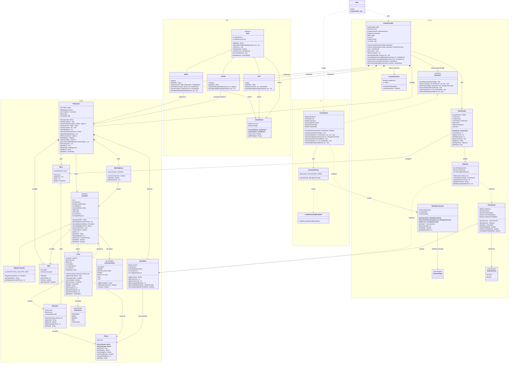

```mermaid
classDiagram
direction TB

namespace model {
    class Customer {
        <<abstract>>
        -int id
        -int arrivalTurn
        -Random tasteRandom
        -int satisfaction
        -CustomerStatus status
        -Table table
        -Order order
        -int servedTurn
        -int readyToPayTurn
        +getTypeName() String
        +getSatisfactionLossPerTurn() int
        +chooseMenuItem(Menu) MenuItem
        +calculateBill(MenuItem) Money
        +placeOrder(Order) void
        +canPayOn(int) boolean
        +getId() int
        +getLabel() String
        +getSatisfaction() int
        +getStatus() CustomerStatus
        +getTable() Optional
        +getOrder() Optional
    }

    class RegularCustomer {
        -int SATISFACTION_LOSS_PER_TURN
        +RegularCustomer(int, int, Random)
        +getTypeName() String
        +getSatisfactionLossPerTurn() int
    }

    class Restaurant {
        -List~Table~ tables
        -WaitingQueue queue
        -List~Customer~ customers
        -Menu menu
        -GameStats stats
        +Restaurant(int, Menu)
        +admit(Customer) void
        +checkCanSeat(Customer, Table) Optional
        +seat(Customer, Table) Table
        +serve(Customer, int) void
        +finishMeals(int) List
        +collectPayment(Customer) Money
        +applyWaitingPenalties() List
        +findCustomer(int) Optional
        +findTable(int) Optional
        +findFreeTable() Optional
        +getCustomersWithStatus(CustomerStatus) List
        +getCustomers() List
        +getTables() List
        +getQueue() WaitingQueue
        +getMenu() Menu
        +getStats() GameStats
    }

    class Table {
        -int number
        -Customer occupant
        +Table(int)
        +getNumber() int
        +isFree() boolean
        +getOccupant() Optional
    }

    class WaitingQueue {
        -List~Customer~ customers
        +contains(Customer) boolean
        +isEmpty() boolean
        +getCustomers() List
    }

    class Order {
        -Customer customer
        -MenuItem item
        -Money bill
        -int turnTaken
        -int unitsPrepared
        -int readyTurn
        -OrderStatus status
        +Order(Customer, MenuItem, Money, int)
        +prepareOneUnit(int) void
        +isServableOn(int) boolean
        +isUnfinished() boolean
        +getCustomer() Customer
        +getItem() MenuItem
        +getBill() Money
        +getTurnTaken() int
        +getUnitsPrepared() int
        +getUnitsRequired() int
        +getStatus() OrderStatus
    }

    class Menu {
        -List~MenuItem~ items
        +Menu(List)
        +getItems() List
        +size() int
        +get(int) MenuItem
    }

    class MenuItem {
        -String name
        -Money price
        -int preparationUnits
        +MenuItem(String, Money, int)
        +getName() String
        +getPrice() Money
        +getPreparationUnits() int
        +toString() String
    }

    class Money {
        -long cents
        +ofCents(long)$ Money
        +ofDollars(long)$ Money
        +getCents() long
        +plus(Money) Money
        +percentage(int) Money
        +isAtLeast(Money) boolean
        +compareTo(Money) int
        +toString() String
    }

    class GameStats {
        -Money revenue
        -int paidCount
        -int paidSatisfactionTotal
        -int servedCount
        -int unhappyDepartures
        +getRevenue() Money
        +getPaidCount() int
        +getServedCount() int
        +getUnhappyDepartures() int
        +getAverageSatisfaction() OptionalDouble
        +isAverageSatisfactionAtLeast(int) boolean
    }

    class CustomerStatus {
        <<enumeration>>
        IN_QUEUE
        SEATED
        WAITING_FOR_FOOD
        EATING
        READY_TO_PAY
        PAID
        LEFT
        +getDescription() String
        +isWaitingForService() boolean
        +isGone() boolean
    }

    class OrderStatus {
        <<enumeration>>
        PREPARING
        READY
        SERVED
        PAID
        CANCELLED
    }
}

namespace staff {
    class Staff {
        <<abstract>>
        -int tasksPerTurn
        -int tasksDoneThisTurn
        +getRole() String
        +describeAvailableTasks(Restaurant, int) List
        +startTurn() void
        +hasTaskLeft() boolean
        +waitThisTurn() ActionResult
        #recordTaskDone() void
        #alreadyBusy() ActionResult
    }

    class Waiter {
        +Waiter()
        +getRole() String
        +seat(Customer, Table, Restaurant) ActionResult
        +takeOrder(Customer, Menu, int) ActionResult
        +serve(Customer, Restaurant, int) ActionResult
        +describeAvailableTasks(Restaurant, int) List
    }

    class Chef {
        +Chef()
        +getRole() String
        +prepare(Customer, int) ActionResult
        +describeAvailableTasks(Restaurant, int) List
    }

    class Cashier {
        +Cashier()
        +getRole() String
        +collectNextPayment(Restaurant, int) Optional
        +describeAvailableTasks(Restaurant, int) List
    }

    class ActionResult {
        -boolean success
        -String message
        +success(String)$ ActionResult
        +failure(String)$ ActionResult
        +isSuccess() boolean
        +getMessage() String
    }
}

namespace control {
    class GameController {
        -GameConfig config
        -GameView view
        -CustomerFactory customerFactory
        -Restaurant restaurant
        -Waiter waiter
        -Chef chef
        -Cashier cashier
        -List~Staff~ staff
        +GameController(GameConfig, GameView)
        +GameController(GameConfig, GameView, CustomerFactory)
        +run() GameResult
        -playTurn(int) void
        -admitArrivals(int) List
        -askUntilValid(Staff, Function, int) void
        -executeWaiterCommand(ManagerCommand, int) ActionResult
        -executeChefCommand(ManagerCommand, int) ActionResult
        -seat(Customer, ManagerCommand) ActionResult
        -withCustomer(ManagerCommand, Function) ActionResult
    }

    class GameConfig {
        +long DEFAULT_SEED
        -int maxTurns
        -int tableCount
        -List~Integer~ arrivalTurns
        -Menu menu
        -Objective objective
        -long seed
        +base(long)$ GameConfig
        +arrivalsAt(int) int
        +getMaxTurns() int
        +getTableCount() int
        +getArrivalTurns() List
        +getMenu() Menu
        +getObjective() Objective
        +getSeed() long
    }

    class CustomerFactory {
        -Random seedSource
        -int nextId
        +CustomerFactory(long)
        +createArrival(int) Customer
    }

    class ManagerCommand {
        -CommandType type
        -int customerId
        -int tableNumber
        +waitCommand()$ ManagerCommand
        +forCustomer(CommandType, int)$ ManagerCommand
        +seat(int, int)$ ManagerCommand
        +getType() CommandType
        +getCustomerId() int
        +hasTable() boolean
        +getTableNumber() int
    }

    class CommandType {
        <<enumeration>>
    }

    class Objective {
        -int minPaidCustomers
        -Money minRevenue
        -int minAverageSatisfaction
        +Objective(int, Money, int)
        +evaluate(GameStats) GameResult
        +getMinPaidCustomers() int
        +getMinRevenue() Money
        +getMinAverageSatisfaction() int
    }

    class GameResult {
        -Objective objective
        -GameStats stats
        -boolean paidTargetMet
        -boolean revenueTargetMet
        -boolean satisfactionTargetMet
        +getOutcome() GameOutcome
        +getObjective() Objective
        +getStats() GameStats
        +isPaidTargetMet() boolean
        +isRevenueTargetMet() boolean
        +isSatisfactionTargetMet() boolean
    }

    class GameOutcome {
        <<enumeration>>
        VICTORY
        DEFEAT
    }

    class GameView {
        <<interface>>
        +showWelcome(GameConfig) void
        +showTurnStart(int, int, Restaurant, List, List) void
        +askCommand(Staff, Restaurant, int) ManagerCommand
        +showActionResult(ActionResult) void
        +showTurnEnd(int, int, List, GameStats) void
        +showFinalResult(GameResult, int) void
    }
}

namespace ui {
    class ConsoleView {
        -BufferedReader in
        -PrintStream out
        -boolean echoInput
        -CommandParser parser
        -Map lastShownTasks
        -boolean inputEnded
        +ConsoleView(InputStream, PrintStream, boolean)
        +showWelcome(GameConfig) void
        +showTurnStart(int, int, Restaurant, List, List) void
        +askCommand(Staff, Restaurant, int) ManagerCommand
        +showActionResult(ActionResult) void
        +showTurnEnd(int, int, List, GameStats) void
        +showFinalResult(GameResult, int) void
    }

    class CommandParser {
        -Map~String, CommandType~ VERBS
        +parse(String) ManagerCommand
    }

    class InvalidCommandException {
        +InvalidCommandException(String)
    }
}

class Main {
    -Main()
    +main(String[])$ void
}

Customer <|-- RegularCustomer

Staff <|-- Waiter
Staff <|-- Chef
Staff <|-- Cashier

GameView <|.. ConsoleView

Restaurant "1" *-- "1..*" Table : manages
Restaurant "1" *-- "1" WaitingQueue : owns
Restaurant "1" *-- "1" GameStats : maintains
Restaurant "1" --> "1" Menu : uses
Restaurant "1" --> "0..*" Customer : tracks

WaitingQueue "1" --> "0..*" Customer : queues

Customer "0..*" --> "0..1" Table : occupies
Customer "1" --> "0..1" Order : places

Order "0..*" --> "1" Customer : belongs to
Order "0..*" --> "1" MenuItem : contains
Menu "1" o-- "1..*" MenuItem : offers

MenuItem --> Money : has price
Order --> Money : stores bill
GameStats --> Money : tracks revenue

Customer --> CustomerStatus : has status
Order --> OrderStatus : has status

GameController --> GameConfig : uses
GameController --> GameView : communicates through
GameController --> CustomerFactory : creates customers
GameController *-- Restaurant : manages
GameController *-- Waiter : coordinates
GameController *-- Chef : coordinates
GameController *-- Cashier : coordinates

GameConfig --> Menu : configures
GameConfig --> Objective : defines

Objective ..> GameStats : evaluates
Objective ..> GameResult : produces
GameResult --> GameStats : contains
GameResult --> GameOutcome : determines

Waiter --> Restaurant : operates on
Waiter --> ActionResult : returns
Chef --> ActionResult : returns
Cashier --> Restaurant : processes payments
Staff --> ActionResult : returns

ConsoleView --> CommandParser : uses
ConsoleView ..> ManagerCommand : produces
CommandParser ..> ManagerCommand : creates
CommandParser ..> InvalidCommandException : throws
ManagerCommand --> CommandType : identifies command

Main ..> GameController : starts
Main ..> ConsoleView : creates
```
